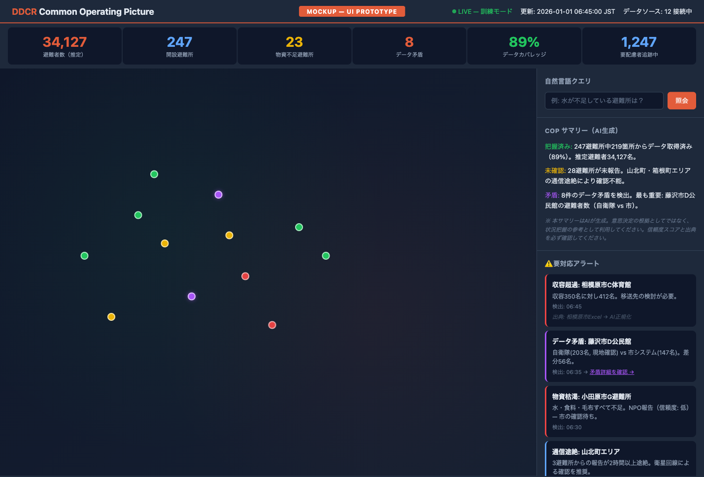
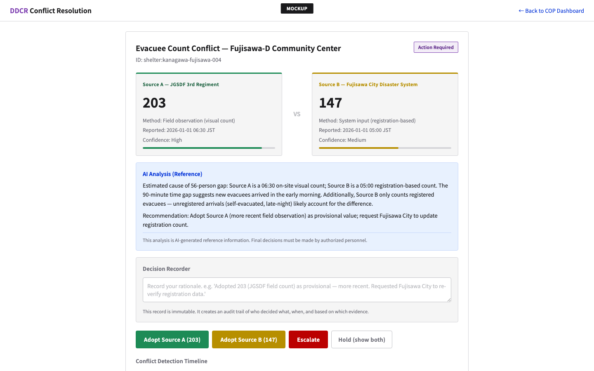
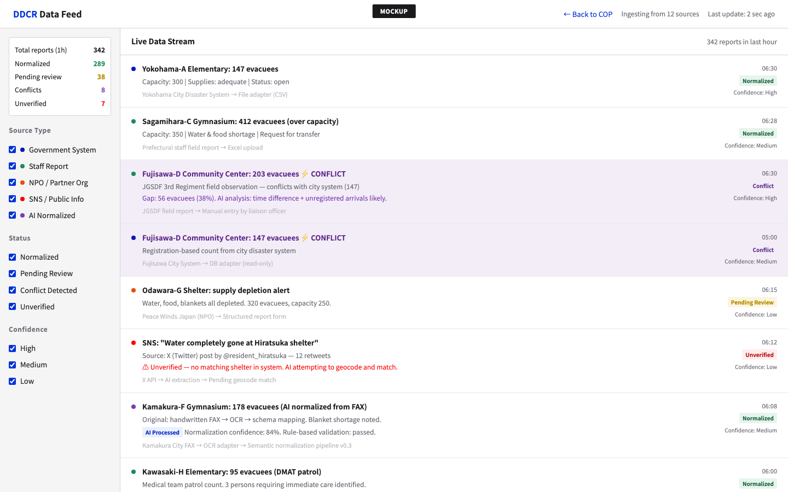

# Disaster Data Commons for Resilience (DDCR)

**災害情報統合のためのオープンソースAIプラットフォーム**

[English](README.md) | 日本語

災害発生時、断片化された情報システムにより「暗黒の72時間」が生まれます。避難者数、避難所の収容状況、物資配分の全体像を誰も把握できない状態です。DDCRは、異種の災害データを統一的な共通状況認識（COP: Common Operating Picture）に正規化することで、この問題を解決します — 既存のシステムを一切置き換えることなく。

## 設計原則

1. **「AIは真実を生成しない — 不確実性を可視化し、人間が意思決定する」** — AIは「正解」を出すのではなく、何がわかっていて、何がわかっていなくて、どこにデータの矛盾があるかを構造化します。
2. **ベンダーエコシステム** — 既存の防災システムベンダーと協調し、アダプターを共同開発します。
3. **ハイブリッド構成** — 機微な個人データはオンプレミスで処理。匿名化された分析ワークロードはクラウドAI（Google Gemini, Vertex AI）を活用。
4. **来歴（Provenance）第一** — すべてのデータポイントに来歴メタデータ（誰が、いつ、どの方法で報告したか、信頼度）を付与。
5. **オープン標準のみ** — JSON Schema、GeoJSON、W3C PROV-O。プロプライエタリなミドルウェアは使用しない。

## UIモックアップ

### 共通状況認識（COP）ダッシュボード

[インタラクティブモックアップを開く](mockups/cop-dashboard.html)

Geolonia Maps上に神奈川県の避難所をリアルタイム表示。ステータス別に色分け（正常/警告/危機/矛盾）。

### データ矛盾解決ビュー

[インタラクティブモックアップを開く](mockups/conflict-view.html)

複数ソースからの矛盾するデータを並列表示し、AI分析（参考情報）と意思決定記録（Decision Recorder）で解決を支援。

### データフィード — マルチソース取り込み

[インタラクティブモックアップを開く](mockups/data-feed.html)

多様なソースからのリアルタイムデータ取り込み状況を表示:
- **行政システム**（信頼度: 高）— CSV/DB自動取り込み
- **職員報告**（信頼度: 中〜高）— 現地確認、Excel
- **NPO/パートナー団体**（信頼度: 中）— 構造化レポート
- **SNS/公開情報**（信頼度: 低）— AI抽出、要検証

## アーキテクチャ

```
既存システム → アダプター層 → AI正規化 → 意思決定支援 → COPダッシュボード
（変更なし）  （ベンダー共同開発）（スキーママッピング、  （矛盾フラグ、      （わかっていること、
                                来歴追跡）        自然言語クエリ）    わかっていないこと、
                                                                  誰が何を言ったか）
```

### ハイブリッドインフラ

| コンポーネント | 環境 | 理由 |
|---|---|---|
| 個人データ処理 | **オンプレミス** | 法的要件、インターネット非依存 |
| リアルタイムCOP生成 | **オンプレミス** | 通信途絶時も動作 |
| スキーマ正規化ルール生成 | **Google Cloud (Gemini)** | 匿名データのみ |
| モデル評価 | **Google Cloud (Vertex AI)** | 匿名テストデータ |
| 衛星被害評価 | **Google Cloud (Geospatial AI)** | 公開衛星画像 |

## スキーマ

DDCRは災害データエンティティのオープンスキーマを定義します。すべて[JSON Schema](https://json-schema.org/)準拠で、特定のミドルウェアなしで使用できます。

| スキーマ | 説明 |
|---|---|
| [`shelter.schema.json`](schemas/shelter.schema.json) | 避難所（収容力、避難者数、物資状況、要配慮者追跡 + 来歴・矛盾） |
| [`supply.schema.json`](schemas/supply.schema.json) | 物資（配分追跡 + 来歴） |
| [`decision.schema.json`](schemas/decision.schema.json) | 意思決定の監査証跡（誰が、いつ、何の根拠で判断したか） |

### 来歴追跡（Provenance Tracking）

すべての観測値に来歴メタデータを付与:
- **誰が**報告したか（ソースエンティティ）
- **どのように**収集したか（現地確認、システム入力、AI正規化 等）
- **信頼度**（高/中/低）
- **いつ**観測したか

### 矛盾の保持（Conflict Preservation）

複数ソースが同じフィールドに異なる値を報告した場合、DDCRはサイレントに上書きせず、全ての矛盾する値を来歴とともに保持します。

## ステークホルダー検証

2つのマルチステークホルダーワークショップで、課題認識と技術アプローチを検証済み:

- **石川県**（2025年3月）— 県庁、被災2自治体、12+企業の50名が参加
- **徳島県**（2025年11月）— 県庁・市町村、10+防災関係組織の50名が参加

両ワークショップで確認: 災害データの多様性、組織横断データベースの必要性、トップダウンの大規模システムだけでは不十分であること。

## 組織

- **[Code for Japan](https://code4japan.org/)** — 申請主体。シビックテックNPO（2013年設立）。佐賀市・浜松市でデータ連携基盤を運用。東京都COVID-19ダッシュボードを構築（65+自治体に展開、グッドデザイン金賞2020）。
- **[DIT/CC](https://bdx.jp/)** — 戦略パートナー。D-CERT（デジタル庁公式の災害デジタル支援チーム）の常設事務局。LINEヤフー、NTT、ソフトバンク、PwC、東京海上、富士フイルム、三井住友海上の7社が設立。
- **神奈川県** — 政府パートナー（940万人、33自治体）。DIT/CC理事が県CDOを兼務。

## UIデザイン

DDCRのUIは[デジタル庁デザインシステムβ版](https://design.digital.go.jp/)に準拠しています。詳細は [mockups/DESIGN.md](mockups/DESIGN.md) を参照。

## 技術スタック

| レイヤー | 技術 | ライセンス |
|---|---|---|
| データベース | PostgreSQL + PostGIS | PostgreSQL License |
| オンプレLLM | Ollama（オープンモデル） | MIT |
| APIサーバー | FastAPI (Python) | MIT |
| 認証 | Keycloak | Apache 2.0 |
| 地図 | Geolonia Maps SDK | MIT |
| クラウドAI | Google Gemini API, Vertex AI | — |

## ステータス

DDCRは現在、スキーマ定義とプロトタイピングの段階です。このリポジトリは開発の進行に伴い成長します。コントリビューションとフィードバックを歓迎します。

## ライセンス

MIT License. [LICENSE](LICENSE) を参照。

---

*災害レジリエンスのためのオープンインフラを構築する*
